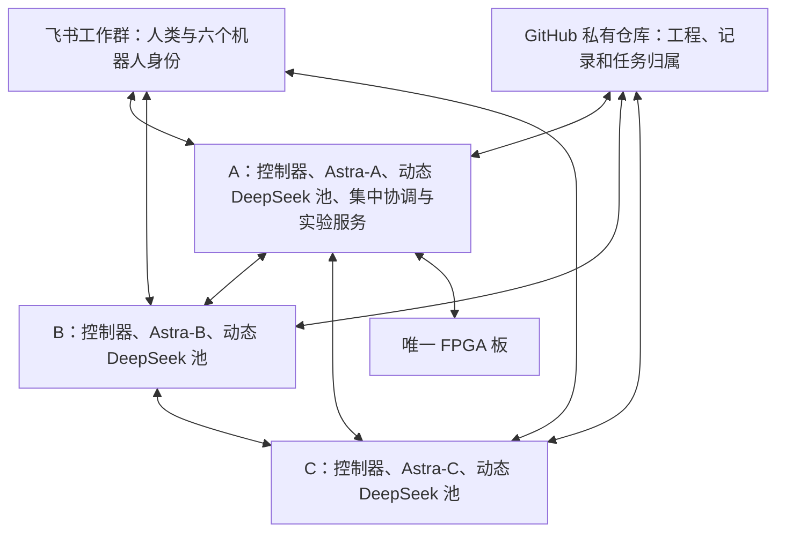

# FPGA 三机多 agent 协作设计稿

日期：2026-09-29。版本：讨论稿 v0.6。

本文汇总本次讨论中用户确认的要求，并给出可审阅的实现设计。本文是设计资料，尚未部署控制程序、机器人、组网或远程仓库。技术默认值在本文中明确列出；实际连通性、模型兼容性和零等待用量需要按验收场景证明。

2026-10-07 部署修订：用户后续明确将 GitHub 仓库 `carolwjade/CarlandFPGA` 设为**公开**，因此本文关于“共享私有仓库/成员邀请”的旧表述由公开克隆与成员 fork/PR 取代。主从协作、六个飞书角色和三机板卡分工仍按本稿执行。实际完成度以 `docs/deployment/DEPLOYMENT_STATUS.md` 为准。

## 1. 已确认的要求

1. 三位成员的电脑分别位于不同网络，通过互联网协作。
2. 每机使用 Codex 作为 harness，运行一个 GPT-6 Astra 主 agent，管理专属于它的 DeepSeek V4.1 Flash 子 agent 池。所有子实例必须使用最高 `max` 推理档位。默认准备两个待命实例，实际调用数量由 Astra 随任务自主增减，可以只用一个、调用多个或暂不调用；两个不是数量上限。团队固定三个 Astra，运行实例总数随子 agent 数量变化。
3. 三个 Astra 分别使用三位成员自己的 ChatGPT/Codex 订阅登录。
4. 使用飞书工作群，固定六个机器人角色：每机的 Astra 独立一个身份，该机全部 DeepSeek 子 agent 共用另一个身份。子 agent 扩缩容不增加飞书角色。主 agent 实时互通、向人类汇报关键事件，并优先响应人类新指令。
5. 子 agent 不主动监听、读取或发送群消息；只有直属主 agent 委托时才执行指定读写。
6. 只有电脑 A 连接 FPGA 板并具备实际烧录和采集条件；集中协调服务也部署在 A。
7. A 离线后，B/C 仍能工作、互相通信、调用各自子 agent、通过飞书汇报和接收指令；实测等待 A 恢复。
8. 等待人类、同伴、子 agent 或外部程序时，等待中的 agent 必须无模型调用、无新增推理 token。
9. 除人类要求及网络、供电、额度、认证等客观障碍外，团队不自动停止。只有一个主 agent 在线时，也能推进自己的任务。
10. 三方工作内容同步到共用的 GitHub 私有仓库，每机独立保存自己负责的内容。所属账号和三位成员账号在部署时补充；现阶段不因此暂停方案设计。凭据不属于工程归档范围。
11. 子 agent 的实时数量、使用时间、工作内容与协作方式全部由直属 Astra 自主决定；DeepSeek V4.1 Flash 模型与最高 `max` 推理档位是用户指定的固定要求，Astra 不自行降低。方案不预设岗位、任务难度、委托比例或固定审查流程；协作成效以不降低质量、明显降低 GPT 套餐 usage 并提高端到端效率为验收目标。

## 2. 部署与职责

| 组件 | A | B | C |
| --- | --- | --- | --- |
| 本地常驻控制器 | 独立运行 | 独立运行 | 独立运行 |
| Codex 主实例 | Astra-A，成员 A 自己登录 | Astra-B，成员 B 自己登录 | Astra-C，成员 C 自己登录 |
| Codex 子实例池 | DeepSeek-A/*，默认 2 个待命，Astra-A 自主伸缩 | DeepSeek-B/*，默认 2 个待命，Astra-B 自主伸缩 | DeepSeek-C/*，默认 2 个待命，Astra-C 自主伸缩 |
| 飞书身份 | Astra-A、DeepSeek-A | Astra-B、DeepSeek-B | Astra-C、DeepSeek-C |
| 本地工程存储 | 仓库副本与任务工作区 | 仓库副本与任务工作区 | 仓库副本与任务工作区 |
| 集中协调与实验排队 | 运行 | 不依赖它完成本地工作 | 不依赖它完成本地工作 |
| 板卡执行服务 | 独立于 Astra 运行 | 提交实验请求 | 提交实验请求 |

每个本地控制器负责飞书连接、节点间通信、收发件箱、持久任务记录、停止状态、模型唤醒、子任务管理、Git 同步和额度检测。这些职责不能只由 A 承担。

A 的集中协调服务汇总进展、帮助安排跨任务依赖并维护实验队列。A 不充当 B/C 通信、认证、群消息、仓库访问或本地派工的唯一入口。

三台使用同一套控制器实现和配置格式，通过节点身份启用对应角色。模型实例运行在各自电脑；中央服务没有第四个调度模型。

每个 Astra 自主决定是否派工、启用多少子 agent、何时扩容或回收、如何分工、串行或并行执行、需要的上下文以及怎样检验和采用结果。子 agent 不设固定岗位，也不要求始终满负荷工作；Astra 可以自行完成不适合委托的任务。默认两个待命仅用于初始准备，不是固定并发数、必须保有的数量或上限。控制器提供执行和观测能力，不用预设策略代替 Astra 的调度判断；硬件资源、服务限流与实际余额等客观条件如实反馈给 Astra。

控制器为每个子实例分配独立 instance_id，保存任务、版本、状态和结果，支持按需创建、唤醒、等待、取消、回收与恢复。回收后保留任务和结果记录，新实例不复用旧实例身份，避免迟到反馈错投。一个子 agent 完成、失败或离线后如何调整工作，由直属 Astra 决定，不自动停掉其他仍有有效任务的子 agent。待命只表示程序与配置就绪，不触发模型推理。

## 3. 跨互联网通信

设计默认采用 Tailscale 加密组网，三个控制器建立两两通信通道：A-B、A-C、B-C。它属于待部署的技术选型，尚未安装或实测。

B/C 必须能在 A 已关机、原连接也已断开的情况下重新建立通信；发现、身份验证和必要中继不能由 A 独占承担。Tailscale 自身控制服务或中继属于外部基础设施依赖；跨网络直连并非所有环境都能实现。

应用消息包含：唯一消息 ID、项目 ID、发送者、接收者、任务 ID、任务版本、发送时间、关联事件及有效期。控制器负责落盘、确认、去重和断线补发。代理报告与人类指令保留不同来源，不能互相冒充。

节点各自保留发送记录和消费位置。在线状态表示观察结果，网络分区时使用“疑似失联”而不是断言对方进程已停止。状态变更通知采用稳定事件 ID、去重和备援发送；不承诺分区条件下群消息严格只出现一次。

## 4. 六个飞书机器人与动态实例映射

六个机器人使用六个独立自建应用身份。各机控制器保存本机两个机器人的凭据，凭据不传给模型、不上传 Git。Astra-A/B/C 分别代表三个主 agent，DeepSeek-A/B/C 分别代表三机各自的整个子 agent 池；增加或回收子实例不创建或删除飞书应用。

三个 Astra 应用分别入群并接收群内用户消息，各自建立事件长连接。因此 A 退出不影响 B/C 收到人类指令。接收全部用户群消息需要相应权限，只有接收 @ 消息的权限不足以满足此设计。

三个 DeepSeek 应用默认不订阅群消息。直属 Astra 可以按任务委托所需的群读写，决定范围和何时撤销；控制器校验并记录委托，不要求每条消息重新发起一轮 Astra 授权推理。人类 @ 某机 DeepSeek 角色的消息由该机 Astra 的消息入口接收，再由 Astra 决定如何处理；不广播唤醒全部子实例，子 agent 也不因被 @ 而自行开始读群或发言。

经委托的子实例通过本机统一收发件箱，以共享的 DeepSeek 身份发送消息；控制器处理发送排队、平台限流和去重，内部关联 instance_id、任务 ID 与原消息 ID，结果返回原请求实例。群消息在需要区分并行任务时标注任务或实例编号，头像和机器人身份保持不变。共享形象不合并子实例的上下文、任务状态或用量记录，也不要求子任务串行执行。

文件与工具访问范围按 Astra 下发任务配置，凭据和其他实例的认证文件保持隔离。子 agent 可以受委托准备或提交实验请求，实际板卡操作统一由 A 的执行服务排队；群读写仍经过控制器核对委托。这些机制不预设子 agent 的技术分工。

各应用按应用 ID 与 message_id 去重；跨节点按群 ID 与 message_id 识别同一人类指令。事件 ID 不能替代消息 ID 作为消息去重依据。

群中发布任务认领、方案结论、接口变化、实验进展、结果、阻塞、上下线和额度告警。日常机器心跳与中间日志留在后台。固定状态通知由程序模板生成，明确标注系统状态来源。

## 5. 人类指令与任务归属

控制器依据飞书提供的真实发送者身份识别人类成员。附件、引用文本、机器人消息和日志属于资料，不自动获得人类指令权限。

明确指向某节点或任务的指令交给相应负责人；全组控制指令同步到全部可达节点。来自同一群消息的新任务使用群 ID 与 message_id 派生稳定任务 ID。各节点可创建以自己身份命名、由自己负责的新独立子任务。

无明确负责人的共享新任务采用以下归属登记协议：控制器在 GitHub 私有仓库的独立 codex/coordination 分支上追加认领记录，记录任务 ID、来源消息、负责人和版本。控制器必须从最新远程提交构造只追加的更新，并使用普通快进 push；不使用强推、自动合并认领冲突或覆盖已有负责人。两个节点并发认领时，远程首先接受的记录生效，失败方重新读取并服从已有归属。推送回执丢失时先查询已落地的记录，不能把本地认领视为成功。

只有确认归属生效的节点启动该共享新任务。其他节点可以接收信息和提供讨论，但不能重复执行同一任务的副作用。GitHub 不可达时，原有任务和明确指给单一节点的独立任务继续；尚未认领的共享新任务先确认收到并等待归属登记。停止、暂停、变更既有任务的指令不等待 GitHub 恢复。GitHub 在这里仅承担低频归属登记，实时通信不经过 Git。

任务转移需有明确人类指令或原负责人交接，追加新的所有权版本，并确认原执行者已停止旧版本的副作用。不能仅根据失联超时转移；无法核实旧执行状态时，允许接收方分析和准备，但先不执行有冲突的共享操作。

人类指令优先于既有代理计划。收到停止类指令后，控制器立即阻止新派工并请求当前工作取消；硬件和外部进程按其安全停止点收尾。对人类分别报告“已收到”“已请求停止”“实际停止”，不能混为一谈。

更改目标、接口或优先级的普通新指令也立即确认并优先送达。Astra 正在工作时，控制器使用运行中追加输入；对于使当前操作失效的明确变更，同时阻止受影响的新副作用，必要时请求中断。旧任务及子任务在下一安全点核对版本，不得一直等待旧模型回合自然完成才处理新指令。已派出的外部进程仍按其实际取消能力处理。

任务包含负责人、版本、目标、允许的操作、依赖、当前阶段、证据和下一步。失联不自动转移所有权。共享接口存在冲突时暂停相关修改，独立任务继续推进。

完全失去飞书和全部同伴连接的节点无法得知新的全局停止指令。默认停止启动新任务，完成必要安全收尾；重连先补齐指令，再决定恢复。单个通信通道故障不应误停仍能接收指令的节点。

重连补收采用持久记录与飞书历史接口联合核对，不能把长连接重连当成无限事件重放：

1. 节点进入 recovering，先把新到的实时事件写入持久缓冲，并固定本轮历史补收的时间上界。
2. 从上次已持久化确认的覆盖界限向前重叠查询群历史，保持同一分页区间与排序，直到所需分页读取结束。与同伴保存的原始指令记录交叉核对。
3. 群历史查询可能只返回话题根消息。维护并核对当前项目范围内的完整可见话题清单，对旧话题也补拉回复；不能只枚举离线期间新建的话题。首次建立基线需检查群历史与话题权限，不能把入群前不可见的记录当成已覆盖。
4. 对未完成任务关联的人类指令重新查询当前消息，检查修改时间、内容版本、撤回或删除状态。用 message_id 关联同一消息的版本；不把修改后的消息当成无关新任务重复执行。
5. 合并历史、同伴记录与实时缓冲，处理覆盖界限之前尚未落地的事件，保存当前有效指令、任务版本、人工暂停和新的覆盖界限，然后重新判断哪些任务可以继续。

分页结束只证明当前权限下的可见集合已枚举，不能证明已删除消息、不可见话题或历史编辑原文都被找回。发现权限、分页、入群连续性、话题覆盖或消息版本缺口时，受影响的旧任务保持等待，列出缺口并由人类重新给出当前有效指令建立新基线；其他已核对清楚的独立工作可继续。不能承诺找回三机都未接收且已被平台删除的指令。

同一任务或全组的人工暂停状态持续保存；只有作用范围明确且晚于相应暂停的恢复指令才能解除。消息编辑、撤回不抹除已执行操作及原始审计记录。无法判断指令先后或修改含义时，先暂停相关副作用，不用消息 ID 的字典序推断人类意图。

## 6. Codex 与模型隔离

每机运行一个 Astra 主实例，以及由它动态管理的 DeepSeek V4.1 Flash 子实例池。实例使用独立配置与会话记录，GPT/DeepSeek 认证隔离，工作区由 Astra 按任务安排。本地控制器通过 Codex app-server 接入；初版固定经联调的版本，并以该版本生成的协议定义为准。实验性接口必须通过兼容性验收。

Astra 使用 gpt-6-astra，由电脑所属成员通过官方 ChatGPT 登录流程授权；各订阅的实际可用性在部署时核实。认证材料留在本机，三方不交换登录状态。部署验证检查真实认证方式、provider、模型和请求路径，不能用显示名称代替路由证据。

所有子实例指定使用 DeepSeek V4.1 Flash，通过 DeepSeek API 接入 Codex。按 2026-09-29 核对的官方说明，当前调用标识为 deepseek-flash；模型显示名保留完整版本，部署时再次核对该别名对应版本及真实路由，不静默换成其他模型。同机子实例可以共用 DeepSeek 计费账户，状态和用量分开记录；余额按实际账户去重统计，不把不同 API key 或动态实例数量当成独立余额份数。

所有子实例的独立 Codex 配置显式设置 `model_reasoning_effort = "max"`，会话和请求级覆盖也必须保持 `max`，不能继承主 agent 的档位或依赖供应商默认值。[DeepSeek 官方 Codex 接入说明](https://api-docs.deepseek.com/quick_start/agent_integrations/codex/)列出 `max` 为支持的最高推理档位，而示例配置默认为 `high`，因此部署时必须显式覆盖。该要求适用于默认待命、动态新增、新会话、唤醒、恢复及重试的全部子实例；简单任务也不能自行降档。

控制器在发出模型请求前核对模型与推理档位，部署联调检查实际生效配置、会话元数据、发往 DeepSeek 的请求参数及服务端可见反馈。仅有界面标签或配置文字不视为已验证；输出长短、推理 token 数也不能证明某一档位。参数不支持、被忽略或发生路由降级时，阻止受影响的子实例继续以不合规配置执行，向 Astra 和群内报告；不静默退回较低档位或替换模型，无关工作继续。待命中的配置检查由普通程序完成，不额外调用模型。

三个 Astra 各自使用所属成员订阅，不自动切换到他人账号或改走 GPT 付费 API。子 agent 在直属 Astra 的任务与授权范围内执行，任务内容和继续条件由 Astra 决定；人类新指令、板卡独占、凭据隔离及不互相覆盖成果的要求对所有实例一致。

## 7. 零 token 等待

等待采用以下生命周期：

1. agent 在有效工作回合结束时交出结果或等待条件；控制器持续记录文件和任务状态。
2. 确认模型回合已经结束、没有正在生成的请求后，进入等待状态。
3. 普通程序等待网络事件、飞书事件、任务完成回调、进程退出或恢复条件。
4. 程序过滤心跳、重复投递、无关通知和普通日志；这些事件不触发推理。
5. 出现需要理解或决策的新输入时，先校验最新指令、任务版本及权限，再启动一次模型回合。

等待期间不向模型询问“有新消息吗”，不通过反复模型回合执行 sleep/poll，也不让定时心跳触发推理。重连、重试、额度读取、固定公告、保存记录及普通 Git 同步均由程序完成。

每机的 Astra 和所有 DeepSeek 分别计量与等待。Astra 等待子 agent 时，其用量为零；任一 DeepSeek 工作只产生该实例的正常调用，不影响其他等待实例的零 token 状态。全部实例都等待时，均没有模型请求。进入等待前生成交接文字、以及唤醒后读取上下文和分析结果属于有效工作，会产生正常用量。

验收以独立模型实例的请求记录和用量记录为准。账户总用量可能被成员的其他会话影响，不能拿总额度变化直接判断某个等待实例是否空转。

## 8. 订阅额度、上下文与恢复

本地控制器通过 account/rateLimits/read 和更新事件读取当前适用的额度 bucket 与窗口。保留 usedPercent、窗口长度、resetsAt 和读取时间；不写死重置周期，不把上下文容量与订阅额度混为一谈。

初版预警默认设为剩余 20% 与 10%，按节点、bucket 和窗口周期去重；阈值属于可调整配置。群公告显示哪个 agent 受限、观测到的剩余比例与重置时间，并使用明确时区。缺失、null、读取失败或过期信息均标记为未知。

耗尽时，对应 Astra 进入 quota_blocked，控制器继续接收消息、保存记录和查询恢复。控制器不能等耗尽后再依赖模型生成总结。各子 agent 是否继续已有工作及后续步骤，按 Astra 事先给出的安排执行；父 agent 暂不可用本身不触发子任务强制停止。需要 Astra 新决策时才等待，人工暂停和过期任务仍按最新状态处理。

重置时间只用于安排查询。恢复必须重新读取并确认相关阻塞条件解除，再检查：登录身份、最新人类指令、人工暂停、任务版本、任务归属和未完成操作。人类暂停不被额度恢复自动撤销。登录失效时通知本人完成登录，不能用他人凭据替代。

临时限流、网络故障、额度耗尽、登录失效、人工暂停和依赖等待分别记录，使用不同恢复条件。检查采用事件与有限频率读取，失败时退避；不用模型请求探测额度。

上下文接近上限时，在仍可工作的阶段形成交接材料并保存。长任务可压缩或新开会话续接，但任务身份、版本、证据和停止状态保持连续。

本文是工程设计资料，不默认完整塞入每个实例的运行提示词。控制器负责确定性的通信、等待和记录；模型按当前任务获取相关上下文，摘要、差异及原始证据可按需读取，具体读取与验证方式由 Astra 决定。

## 9. 板卡实验服务

所有烧录、复位、测试与采集统一经过 A 的板卡执行服务。锁覆盖准备、烧录、测试、采集和清理整个实验。服务独立于 Astra-A；Astra-A 额度耗尽时，在线的板卡服务仍可执行其他实例提交且在有效授权范围内的实验。

实验请求指定任务和版本、代码提交、构建配置、测试步骤、预期结果及唯一 operation_id。结果关联实际文件哈希、板卡身份、工具版本、脚本版本、原始日志与判定，不把仿真或编译通过写成板上通过。

请求重试沿用同一 operation_id。回执丢失时查询原操作；烧录进程失联或服务重启后状态不明，进入待核对，不能把通信超时当成板卡空闲，更不能直接重烧。

A 离线时 B/C 保存实验请求并继续不依赖实测的工作。A 重连后先同步人类指令及任务版本，核对硬件状态，再接收仍然有效的实验。实际板卡型号、工具链和采集接口作为硬件适配器的部署输入，不影响通信层设计。

## 10. 私有 Git 仓库与本地保存

共享私有仓库托管在 GitHub，独立于 A。每机直接访问远程，保留完整 Git 仓库副本、自己负责的任务工作区和运行记录；大型 LFS 文件按任务需求下载，并在产出机保留本地原件。所属账号和成员账号由用户后续提供，不推测账号归属或提前创建仓库。

工程源码、约束、配置、构建脚本、测试、设计方案、任务记录、人类指令记录、协作结论、交接材料及实验报告进入普通 Git。bitstream、波形和大体积原始证据采用 Git LFS，并保存清单与校验值。失败尝试和进行中的工作同样归档。

认证文件、API key、飞书密钥和机器私密配置留在本地凭据存储。日志归档前脱敏。可重新生成的工具缓存和临时锁文件不属于工作成果；复现实验所需输入、配置和产物必须保留。

任务分支使用 codex/a/<task-id>、codex/b/<task-id>、codex/c/<task-id> 等命名。Astra 自主安排本机各实例的工作区、分支和写入归属；需要隔离时使用独立工作区，确保并发修改不会静默覆盖。不同文件位于同一目录不构成一律禁止并行的理由。

在稳定修改批次、任务切换、进入等待或安全收尾时保存检查点，并通过程序提交到相应分支和推送。保存检查点需与写入者协调，不能在生成文件写到一半时截取不一致快照。检查点明确标注进行中、未验证或已验证。

同步可以自动化，合并需结合变更和检查结果。获取远程更新不直接覆盖正在工作的目录。主分支更新冲突时重新读取、处理并验证；不强推覆盖其他人的历史。集成权限不绑定 A 在线；需要板卡实测的验收仍保留为条件。

远程不可达时保留本地提交与待推送记录，自动退避重试。Git 负责工程版本和协作记录的持久归档；实时指令、停止信号及在线检测仍走飞书与控制器连接。

## 11. 状态与独立运行

每个实例分别记录 working、idle、waiting_peer、waiting_subagent、waiting_human、waiting_hardware、quota_blocked、auth_required、human_paused 和 recovering 等状态。连接状态单独表示，不把 Astra 限额或某个子 agent 待命误报为电脑离线。

有可执行任务时继续推进；无可执行任务时保留事件等待。失败任务可以等待诊断或新条件，不能阻塞无关任务，也不能通过无新证据的无限重试保持表面运行。

只有一个 Astra 在线时，可推进自己已负责的任务、接收人类新任务并自行管理自己的子 agent 池。任务转移必须有明确归属记录；不因其他节点失联自动夺取它们的工作。

### 协作效果验收

调度策略由 Astra 自主调整，方案只检验结果，不规定必须下放哪些工作或必须达到多少委托比例。使用代表性任务，对比同等需求和环境下的 Astra 独立完成方式与 Astra 自主伸缩、调度子 agent 池的方式，协作样本中的子实例均保持 DeepSeek V4.1 Flash 的 `max` 档位。优先复用可比的历史基线和正常任务记录；必要时做小规模配对、交替顺序与重复取样，避免只选择成功或特别适合并行的案例，不要求 Astra 为了评估重新做完每项子任务。

- 质量：保持相同交付标准，检查需求完成情况、验收结果与遗留缺陷，失败和后续修复也纳入记录。检查或审查方式由 Astra 按任务选择，不降低既定验收标准。
- GPT 套餐 usage：记录每个账户、适用 bucket 与窗口的实际额度变化；包含派工、上下文交接、结果阅读、检查及返工所消耗的 GPT 用量。控制同期其他会话使用并标明无法排除的干扰，跨重置的样本分段，不把 token 数量或调用次数直接换算为套餐节约比例。
- 效率：比较接单到最终验收通过的实际耗时，包含调度、沟通、等待、检查、返工与重试；并行运行的时长不重复累加。DeepSeek 用量和费用单列，不混同为 GPT 套餐用量。

只有质量保持、套餐 usage 下降和交付提速在重复样本中稳定出现，且改善超过观测粒度与自然波动，才认定实现目标。指标不理想时由 Astra 调整并发数量、委托方式、减少无效沟通或收回不合适的任务，不靠增加固定规则或强迫子 agent 满负荷运行解决。平台粒度或其他会话干扰导致无法可靠归因时，报告套餐节约尚不能量化，不把读数暂未变化解释为零消耗；实测前不承诺节约百分比。

## 12. 验收场景

| 编号 | 场景 | 必须观察到的结果 |
| --- | --- | --- |
| A01 | Astra 等待同伴、人类或子 agent，其中部分子 agent 仍在工作 | 等待实例无模型请求；工作实例单独计量；没有后台推理轮询 |
| A02 | 默认待命及动态新增的 DeepSeek 实例分别待命或等外部进程 | 无未经父级委托的群读写，无等待期间推理 |
| A03 | 三方收到同一人类任务事件，且重复投递 | 按消息去重，单一任务负责人，不重复执行 |
| A04 | A 整机关闭，原 B-C 连接也关闭 | B/C 可以重连、工作、互发消息并各自收发飞书 |
| A05 | A 离线期间 B/C 修改工程 | 各自保存、推送、获取与按规则集成；实验请求排队 |
| A06 | 仅一个主 agent 在线 | 可以推进自己的任务，团队控制程序保持在线 |
| A07 | Astra-A 额度耗尽，A 控制器及板卡服务在线 | Astra-A 等待恢复；子任务按其有效安排继续；其他实例仍可申请已授权实验 |
| A08 | 额度重置时间到达，但查询失败或仍受另一窗口限制 | 不误判恢复，不自动切账户或调用付费 API |
| A09 | 人类暂停后额度恢复 | 保留人工暂停，直到收到有效恢复指令 |
| A10 | 三方同时申请板卡 | 全实验无交叠，结果关联正确代码和任务版本 |
| A11 | 烧录中断网、回执丢失或服务重启 | 核对原 operation_id，状态不明时不盲目重烧 |
| A12 | 烧录期间人类要求停止或改任务 | 及时确认，停止新派工，当前操作按安全点收尾 |
| A13 | 子 agent 接受群操作或实验委托 | 默认不自主读发群；Astra 的有效委托可执行；板卡操作仍统一排队，凭据保持隔离 |
| A14 | Git 远程不可达后恢复 | 本地内容与待同步提交不丢失，重试无模型调用 |
| A15 | 同改文件、并行推送、大产物恢复 | 无静默覆盖；大文件可按哈希完整取回 |
| A16 | 节点失去全部指令通道后重连 | 停止新派工；补齐指令后再判断恢复，旧计划不自动复活 |
| A17 | B/C 并发认领同一无对象群任务，A 离线 | 只有远程已确认的一个负责人执行；认领回执丢失可查询恢复 |
| A18 | GitHub 暂不可达，但飞书及节点通信可用 | 既有工作、明确指定的独立任务及停止指令继续；无归属共享新任务等待登记 |
| A19 | Astra 忙碌时收到人类目标或接口变更 | 立即确认并优先送达，受影响旧任务和子任务在安全点重新核对版本 |
| A20 | 三机都离线期间出现顶层指令、旧话题新回复、早先指令修改或撤回 | 历史、话题与原指令版本均被核对；有缺口时不自动恢复受影响旧任务 |
| A21 | 每个 Astra 自主伸缩 V4.1 Flash 子 agent 池 | 从默认 2 个待命切换为单个工作、超过 2 个工作及回收；分别记录状态与成果，迟到反馈不串任务，控制器不固定数量和技术分工 |
| A22 | 代表性任务进行独立完成与协作完成的重复比较 | 质量保持，完整 GPT 套餐 usage 明显下降，端到端效率提高；数据不足时如实标记未验证 |
| A23 | 同机多个子实例受委托同时操作群，期间继续扩缩容 | 全群始终只有六个机器人角色；本机子实例共用 DeepSeek 身份，任务可追溯、结果不串实例；@ 共享角色不自动唤醒子实例 |
| A24 | 默认、新增、新会话、唤醒、恢复和重试的子实例执行简单及复杂任务 | 均使用真实 DeepSeek V4.1 Flash 路由与最高 `max` 档位；不支持、参数失效或降级时阻止受影响调用并报告；检查待命配置不触发模型推理 |

## 13. 落地顺序与部署输入

实施分成以下阶段。前两个阶段可用本地测试替身推进，不依赖 GitHub 所属账号、飞书应用凭据或实体板卡；替身验收只证明程序行为，不能冒充真实模型和跨机实测。

| 阶段 | 交付内容 | 阶段验收 | 所需外部条件 |
| --- | --- | --- | --- |
| P0：冻结协议 | 节点身份、事件格式、任务状态、委托权限和恢复规则 | 场景走查没有归属冲突；接口具备去重、版本与持久化语义 | 无 |
| P1：单机控制器 | 事件存储、收发件箱、任务状态机、零推理等待和三节点本地模拟 | 无事件不调用模型；重复事件不重派；退出重启可恢复 | 无；使用明确标识的替身 |
| P2：真实 Codex 与动态子实例池 | 一个 Astra 与默认 2 个待命 V4.1 Flash、全部子实例固定 max、按需增减、自主派工、订阅额度和唤醒 | 核对真实路由与 max 实际生效；验证扩缩、恢复、重试不降档及零等待；运行协作效果对比 | 一位成员本机登录、DeepSeek 配置 |
| P3：飞书六角色 | 人类指令入口、群报告、每机子实例共用身份、Astra 按任务委托群操作 | 三个主应用独立收消息；三个子应用默认不监听；扩缩容不增身份，结果路由及去重正确 | 飞书自建应用、权限及工作群 |
| P4：三机与 GitHub | 两两通信、各机仓库、LFS、检查点同步、A 离线运行 | A 关机后 B/C 重新连接并继续收发群及同步代码 | 三机网络、GitHub 私有仓库访问、LFS 配额 |
| P5：真实板卡 | 工具链适配、独占实验、结果归档和未知状态核对 | 并发请求无交叠；回执丢失不盲目重烧；停止和恢复正确 | A 上的板卡、驱动、工具链与测试连接 |

三机协作必须保留可观察的本地状态：当前任务、等待原因、模型调用计数、队列长度、未同步提交、节点连通情况、适用额度及最近一次检查时间。系统完成一个开发阶段时保持在线，等待后续任务；不会因阶段结束自动关闭团队服务。

实施前由部署表提供：节点与人类成员对应关系、各机操作系统、私有仓库 URL 与访问方式、Git 提交显示名与邮箱、飞书群 ID 与各应用身份、DeepSeek 计费账户关系、FPGA 板卡及工具链信息。密钥通过本机配置流程输入，部署表只保存引用和非敏感标识。

本稿创建时，本地 Git 仓库尚无提交，未配置远程地址及提交作者。本文先作为本地可审阅文档保存；待部署阶段账号、仓库地址和提交身份补齐后，再按约定提交并同步。这些输入不阻塞当前设计文档和独立本地验证方案的完善。

## 14. 官方依据

- [Codex app-server：登录、回合生命周期、额度与事件接口](https://learn.chatgpt.com/docs/app-server)
- [GPT-6 Astra 模型标识](https://developers.openai.com/api/docs/models/gpt-6-astra)
- [Codex 配置与状态隔离](https://learn.chatgpt.com/docs/config-file/config-advanced)
- [DeepSeek Responses 与 Codex 接入](https://api-docs.deepseek.com/guides/responses_api/)
- [DeepSeek Codex 配置与 max 推理档位](https://api-docs.deepseek.com/quick_start/agent_integrations/codex/)
- [DeepSeek V4.1 Flash 发布及当前调用标识](https://api-docs.deepseek.com/updates/)
- [DeepSeek 余额查询](https://api-docs.deepseek.com/api/get-user-balance/)
- [飞书接收消息](https://open.feishu.cn/document/server-docs/im-v1/message/events/receive)
- [飞书长连接](https://open.feishu.cn/document/server-docs/event-subscription-guide/event-subscription-configure-/request-url-configuration-case)
- [飞书历史消息与分页](https://open.feishu.cn/document/server-docs/im-v1/message/list)
- [飞书指定消息查询](https://open.feishu.cn/document/server-docs/im-v1/message/get)
- [飞书事件重推机制](https://open.feishu.cn/document/server-docs/event-subscription-guide/overview)
- [Tailscale 连接与中继](https://tailscale.com/docs/reference/connection-types)
- [Git 工作流](https://git-scm.com/docs/gitworkflows)
- [Git 推送与并发更新规则](https://git-scm.com/docs/git-push)
- [Git LFS](https://git-lfs.com/)

以上文档支持接口与能力判断；本文的故障处理、调度规则和验收目标属于本项目设计，不是对服务供应商可用性或延迟的保证。
